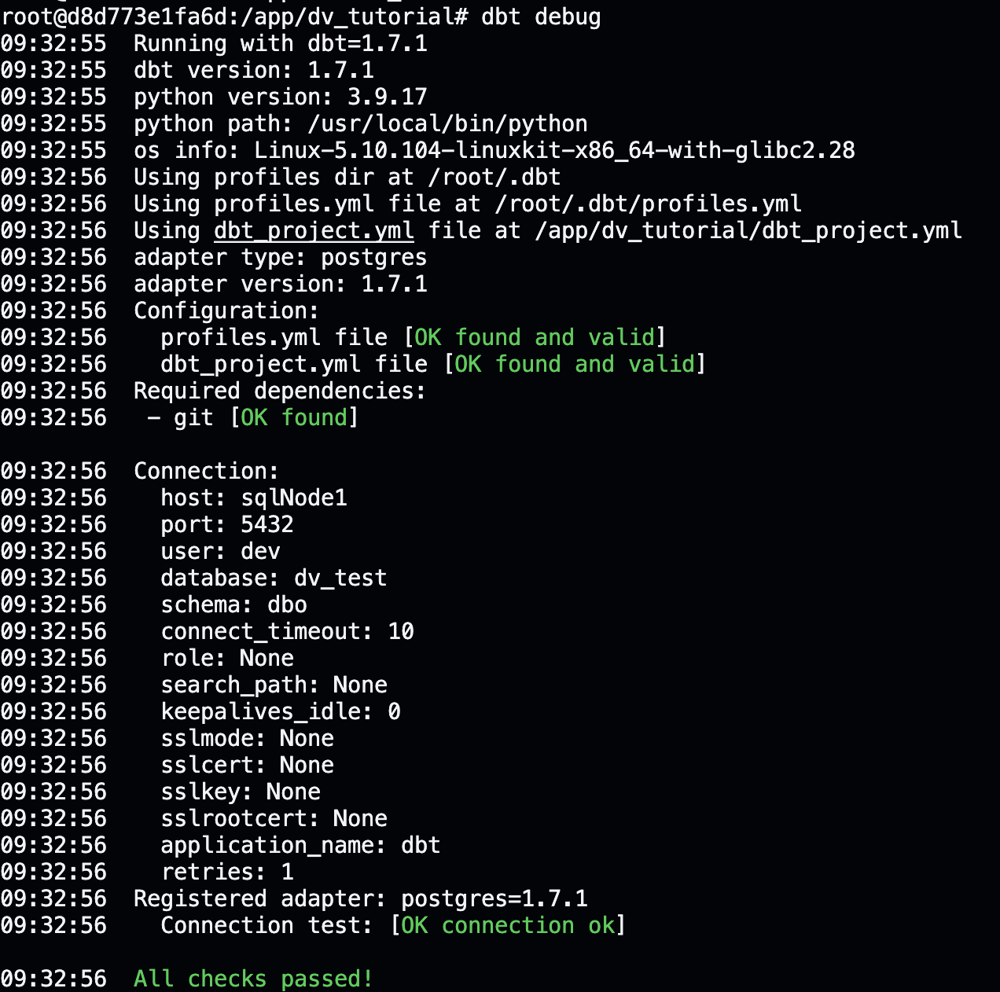
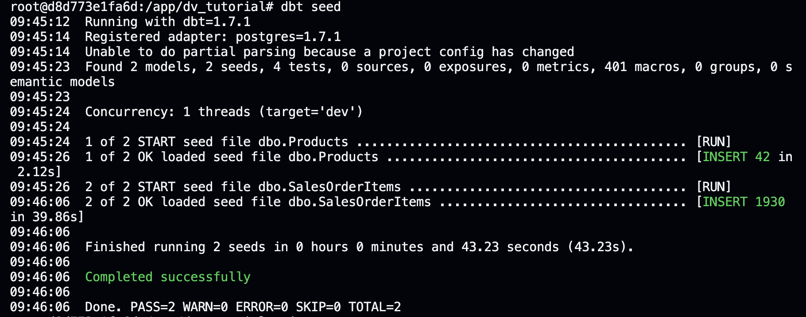

# Welcome to your new dbt project!

## Steps to recreate

>Note: Notice the variable settings in the .env file.

```bash
docker-compose up 
```

In another shell we start the python dev environment container:

```bash
docker run -it --network=dv_tutorial_db-server-network --mount src="$(pwd)",target=/app,type=bind dv_tutorial_dbt bash
```

Now a command line in the dev container will open.

In this container we run:

```bash
dbt init
```

You will be asked to provide some information:

1. name: dv_tutorial
2. 1 -> postgres 
3. as shown below (or save the content to `/root/.dbt/profiles.yml`):

```bash
dv_tutorial:
  outputs:
    dev:
      dbname: dv_test
      host: sqlNode1
      pass: abcd
      port: 5432
      schema: dbo
      threads: 1
      type: postgres
      user: dev
  target: dev
```

Now running:

```bash
dbt debug
```

should show a working setup and database connection.



Now copy the datafiles:

- Products.csv
- SalesOrderItems.csv

from Kaggle ([Link](https://www.kaggle.com/datasets/yasinnaal/bikes-sales-sample-data/))
and save them in to the seed directory.

Next we run:

```bash
dbt seed
```

This takes a moment and will insert the data into the database.



### Using the starter project

Try running the following commands:

- dbt run
- dbt test

### Resources

- Learn more about dbt [in the docs](https://docs.getdbt.com/docs/introduction)
- Check out [Discourse](https://discourse.getdbt.com/) for commonly asked questions and answers
- Join the [chat](https://community.getdbt.com/) on Slack for live discussions and support
- Find [dbt events](https://events.getdbt.com) near you
- Check out [the blog](https://blog.getdbt.com/) for the latest news on dbt's development and best practices
