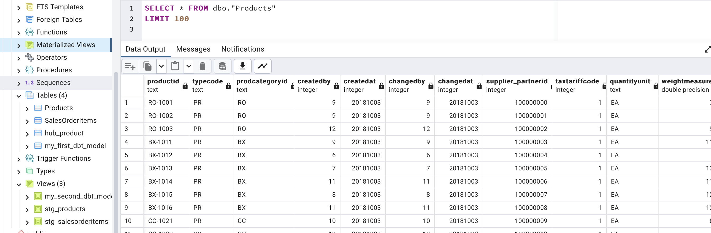
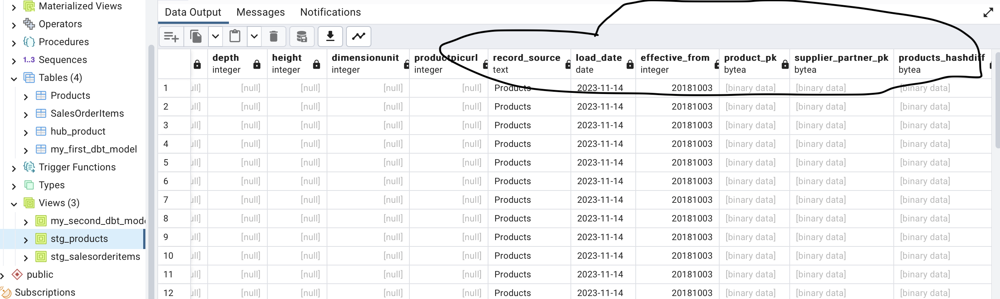
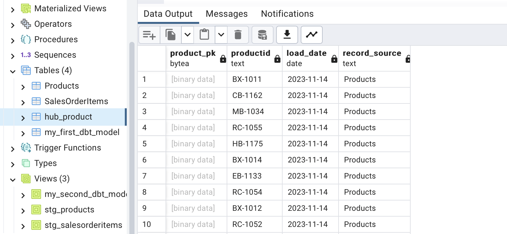
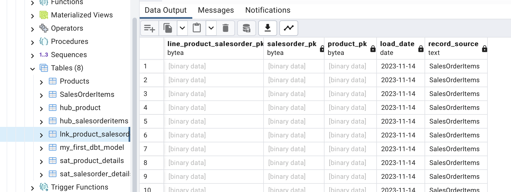
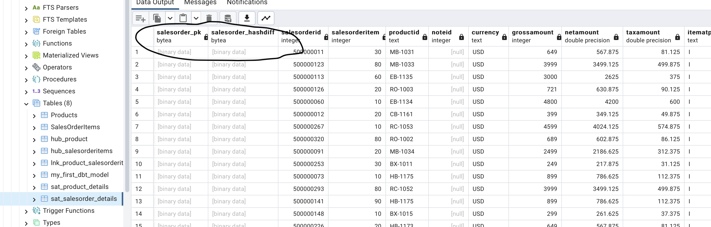
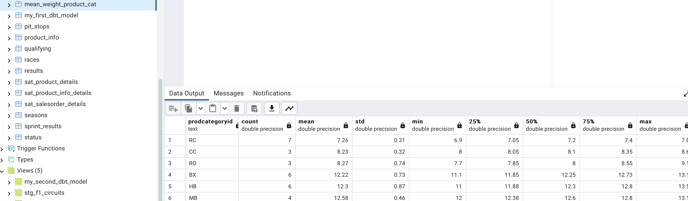
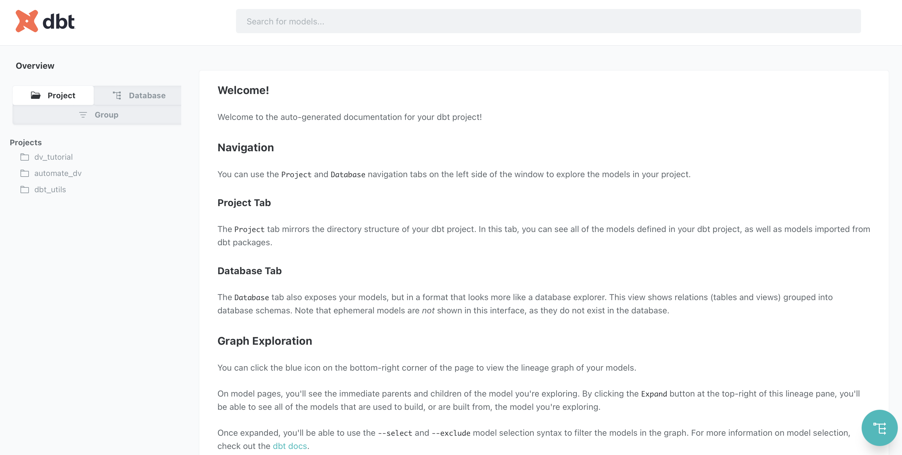
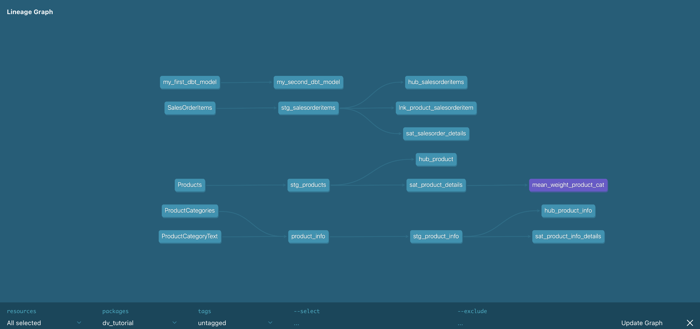
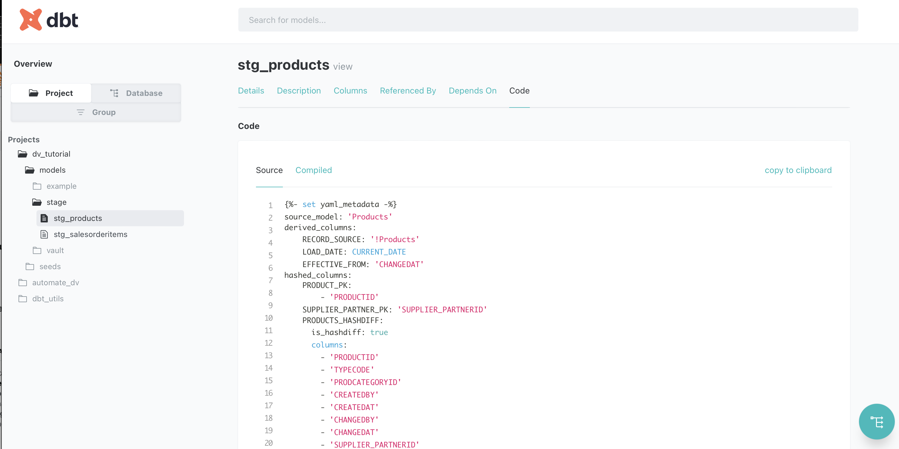
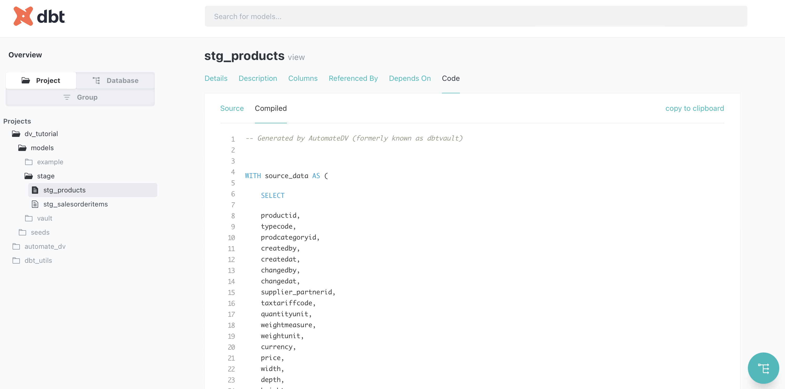

# Welcome to your new dbt project

## Steps to recreate

>Note: Notice the variable settings in the .env file.

Start the PostGres database and PostGresAdmin (webinterface to the database - see images further below):

```bash
docker-compose up 
```

In another shell we start the python dev environment container (Python 3.9 on Debian 9 with pandas and dbt-postgres installed):

```bash
docker run -it --network=dv_tutorial_dbt_postgress_db-server-network --mount src="$(pwd)",target=/app,type=bind dv_tutorial_dbt_postgress-dbt bash
```

Now a command line in the dev container will open. In this container we run:

```bash
dbt init
```

You will be asked to provide some information:

1. name: dv_tutorial
2. choose 1 -> postgres
3. as shown below (or save the content to `/root/.dbt/profiles.yml` in the container):

```bash
dv_tutorial:
  outputs:
    dev:
      dbname: dv_test
      host: sqlNode1
      pass: abcd
      port: 5432
      schema: dbo
      threads: 1
      type: postgres
      user: dev
  target: dev
```

## Database connection

Let us now check the database connection and setup:

```bash
dbt debug
```

This should show a working setup and database connection.


## Getting some test data from Kaggle

Now copy the data files:

- Products.csv
- SalesOrderItems.csv

from Kaggle ([Link](https://www.kaggle.com/datasets/yasinnaal/bikes-sales-sample-data/))
and save them into the seed directory.

## Load the raw data into the database

Next we load the raw data in the database run:

```bash
dbt seed
```

This takes a moment and will insert the data into the database.

>Note: Use raw stage sqls to generate a combined table from multiple sources. This allows to pull the
> data in one table and then use the staging sql statements to generate a staging table.


In the image below we can see that the raw tables are loaded into the database.

]

`dbt` allows you to run separate stage scripts so you can trace step by step what you are doing. If you want to run everything at once: `dbt run`.

## Dependencies: automate-dv

Now you need to install the dependencies (`packages.yml`):

```yaml
packages:
  - package: Datavault-UK/automate_dv
    version: 0.10.1
```


## Creating the staging tables

```bash
# dbt run -s name_of_component
dbt run -s stg_product  --full-refresh # if you put a + in front of stg_product it also runs raw sql if you have that
dbt run -s stg_salesorderitems  --full-refresh 
```



## Loading Raw Vault

### Creating hubs

```bash
dbt run -s hub_product  --full-refresh 
dbt run -s hub_salesorderitems  --full-refresh 
```



### Creating links

```bash
dbt run -s lnk_product_salesorderitem  --full-refresh 
```



### Creating satellites

```bash
dbt run -s sat_product_details  --full-refresh 
dbt run -s sat_salesorder_details  --full-refresh 
```



### Aggregating

As a test I tried to aggregate some simple data using a python model (`models/aggregate/mean_weight_product_cat.py`). In order for this to work I needed a third-party library `dbt-fal[postgres]`.

>NOTE: Install first dbt-fal[postgres] and then dbt-postgres, otherwise you have some version issues.



## dbt auto doc generation

`dbt` can autogenerate docs.

```bash
dbt docs generate
dbt docs serve 
```



## Data lineage view of the docs



## Implementation details 




